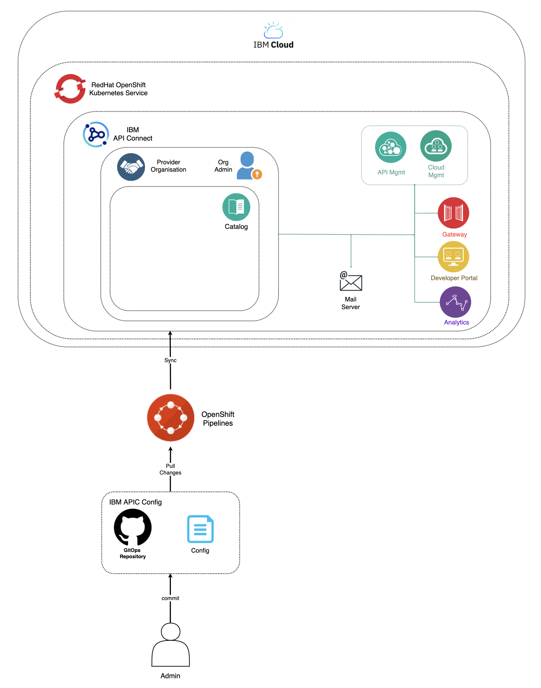

# API Connect Post Install Configuration Pipeline

This GitHub repository stores the work done around automating the IBM API Connect v10 post installation configuration.

Since IBM API Connect does not yet support the definition of your IBM API Connect instance's configuration in a declarative manner so that a GitOps approach can be applied to manage such configuration of your IBM API Connect instance, this automation work aims to ease the IBM API Connect post installation configuration. This automation does not replace a proper full GitOps strategy, which is the end goal for managing anything and everything regarding your IBM API Connect instances, but at least gives the foundation to automate the IBM API Connect post installation configuration so that if your actual cluster needs to be replicated somewhere else, no matter what the reason is, at least the new cluster should, indeed, be an exact replica as far as the same configuration should be applied to this new cluster.

